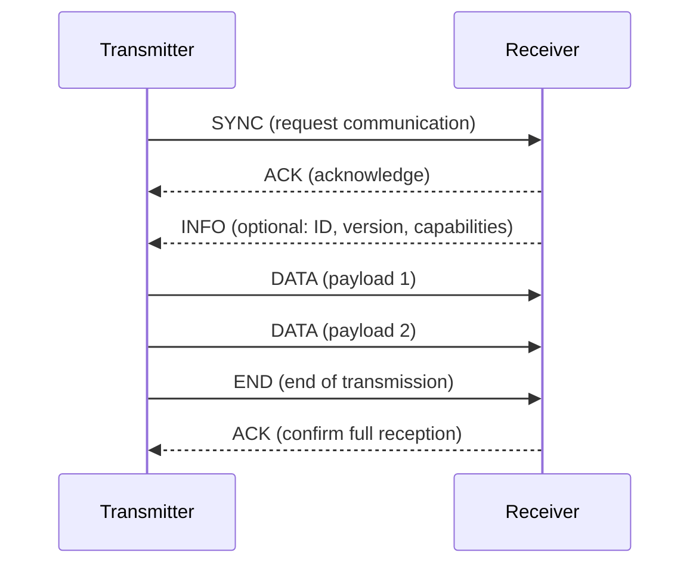

# pbcp

Piraterna's Baseband Communication Protocol

## Protocol

The PBCP protocol definition can be found in include/protocol.h

### Handshake diagram

```mermaid
sequenceDiagram
    participant TX as Transmitter
    participant RX as Receiver

    TX->>RX: SYNC (request communication)
    RX-->>TX: ACK (acknowledge)
    RX-->>TX: INFO (optional: ID, version, capabilities)
    TX->>RX: DATA (payload 1)
    TX->>RX: DATA (payload 2)
    TX->>RX: END (end of transmission)
    RX-->>TX: ACK (confirm full reception)
```